# Tutorial Intro

Let's discover **Docusaurus in less than 5 minutes**.

## Getting Started

Get started by **creating a new site**.

Or **try Docusaurus immediately** with **[docusaurus.new](https://docusaurus.new)**.

### What you'll need

- [Node.js](https://nodejs.org/en/download/) version 18.0 or above:
  - When installing Node.js, you are recommended to check all checkboxes related to dependencies.

## Generate a new site

Generate a new Docusaurus site using the **classic template**.

The classic template will automatically be added to your project after you run the command:

```bash
npm init docusaurus@latest my-website classic
```

You can type this command into Command Prompt, Powershell, Terminal, or any other integrated terminal of your code editor.

The command also installs all necessary dependencies you need to run Docusaurus.

## Start your site

Run the development server:

```bash
cd my-website
npm run start
```

The `cd` command changes the directory you're working with. In order to work with your newly created Docusaurus site, you'll need to navigate the terminal there.

The `npm run start` command builds your website locally and serves it through a development server, ready for you to view at http://localhost:3000/.

Open `docs/intro.md` (this page) and edit some lines: the site **reloads automatically** and displays your changes.

# PostHog 指南

欢迎来到 PostHog 使用指南！

## PostHog 是什么？

PostHog 是一个开源的产品分析平台，它可以帮助您：

```mermaid
%%{
  init: {
    'theme': 'base',
    'themeVariables': {
      'primaryColor': '#8d6e63',
      'primaryTextColor': '#3e2723',
      'primaryBorderColor': '#5d4037',
      'lineColor': '#795548',
      'secondaryColor': '#efebe9',
      'tertiaryColor': '#d7ccc8',
      'mainBkg': '#efebe9'
    }
  }
}%%
flowchart LR
    A[🦔 数据收集] --> B{📊 数据分析}
    B -->|用户行为| C[👥 用户洞察]
    B -->|特征分析| D[🎯 产品决策]
    C -->|改进建议| E[⚡️ 产品优化]
    D -->|实施方案| E
    style A fill:#efebe9,stroke:#5d4037,color:#3e2723
    style B fill:#8d6e63,stroke:#5d4037,color:#efebe9
    style C fill:#d7ccc8,stroke:#5d4037,color:#3e2723
    style D fill:#d7ccc8,stroke:#5d4037,color:#3e2723
    style E fill:#8d6e63,stroke:#5d4037,color:#efebe9
```



## 主要功能

PostHog 提供了一套完整的产品分析工具：

```mermaid
mindmap
  root((🦔))
    (数据分析)
      [事件追踪]
      [漏斗分析]
      [留存分析]
    (产品优化)
      [A/B 测试]
      [功能标志]
    (用户体验)
      [会话回放]
      [热力图]
    (数据管理)
      [数据仓库]
      [API 集成]
```



## 开始使用

1. 事件追踪
2. 漏斗分析
3. 用户路径分析
4. 功能标志
5. 会话回放
6. A/B 测试
