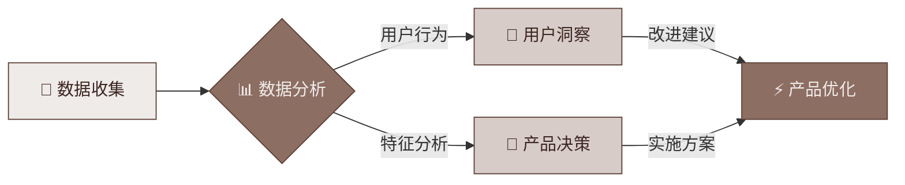
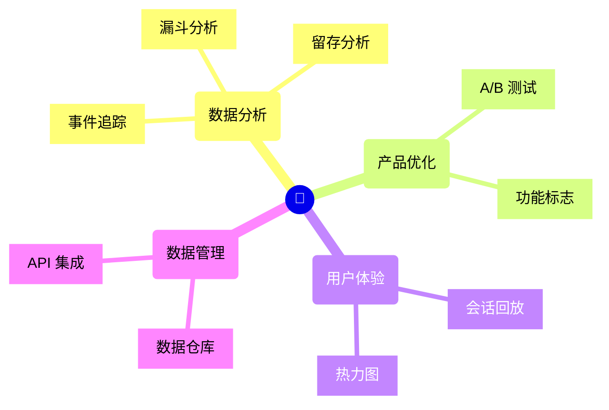

import GitHubCard from '@site/src/components/GithubCard';

# PostHog 指南

<GitHubCard repo="PostHog/posthog" />

欢迎来到 PostHog Guide 中文社区！

## PostHog 是什么？

PostHog 是一个开源的产品分析平台，它可以帮助您：

## 主要功能

PostHog 提供了一套完整的产品分析工具：

## 开始使用

1. 事件追踪
2. 漏斗分析
3. 用户路径分析
4. 功能标志
5. 会话回放
6. A/B 测试
