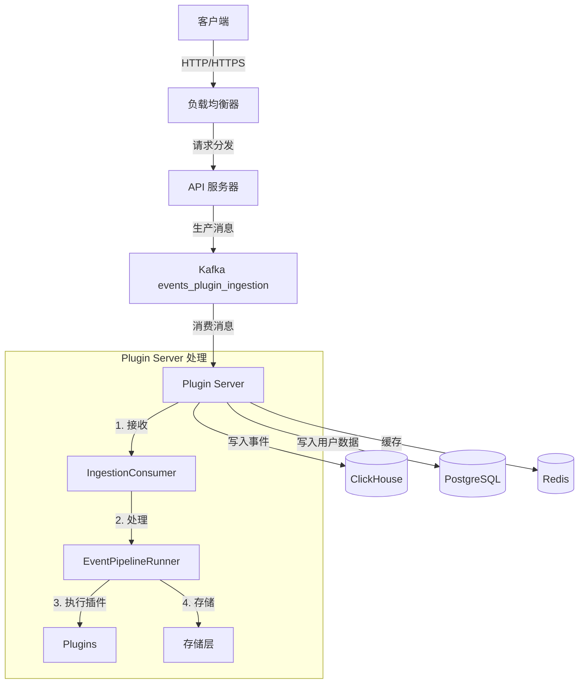
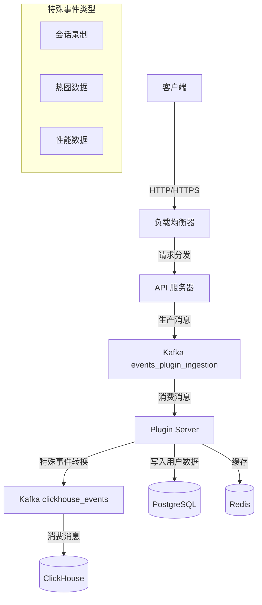
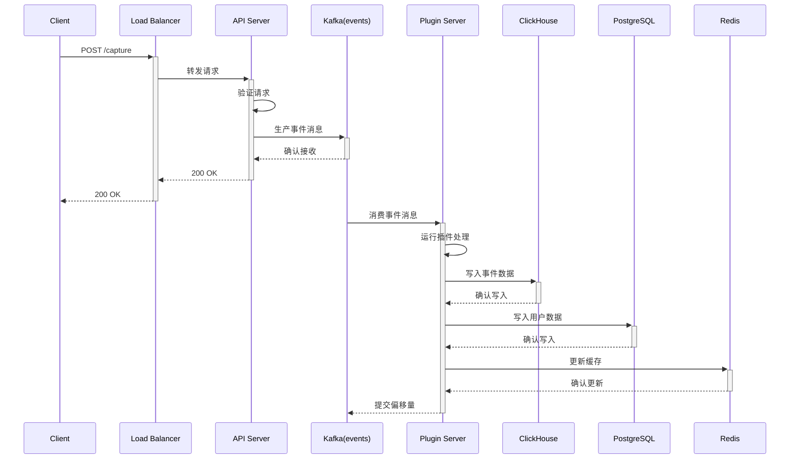
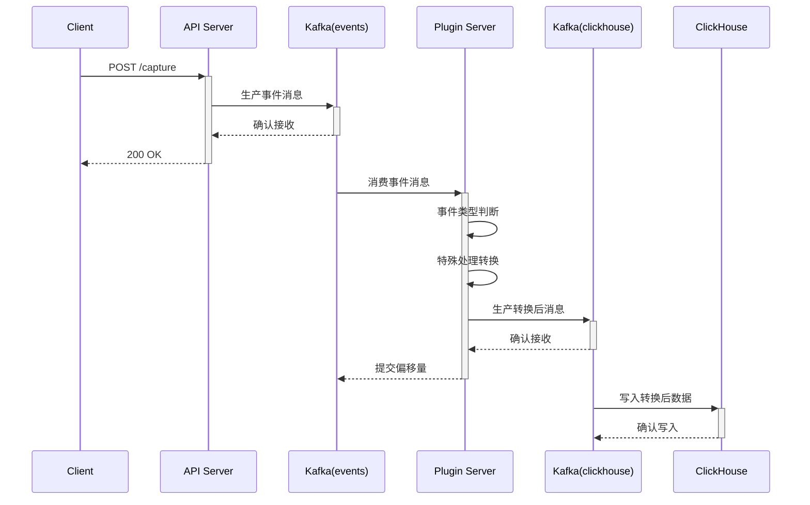

# PostHog 数据摄入架构

## 数据流程概述

PostHog 的事件处理系统支持两种主要的数据流程，分别用于处理普通分析事件和特殊事件。

### 1. 标准分析事件流程



### 2. 特殊事件流程



## Kafka Topics 说明

### 1. 标准事件 Topics
- `events_plugin_ingestion`: 主要的事件摄入 topic
- `events_plugin_ingestion_historical`: 历史数据摄入
- `events_plugin_ingestion_overflow`: 溢出处理

### 2. 特殊事件 Topics
- `clickhouse_session_recording_events`: 会话录制数据
- `clickhouse_session_replay_events`: 会话回放数据
- `clickhouse_heatmap_events`: 热图数据
- `clickhouse_performance_events`: 性能监控数据

## 请求流程详解

### 1. 标准分析事件



### 2. 特殊事件处理



## 高可用要求

为了保证消息摄入的高可用性，需要确保以下组件的冗余和高可用配置：

1. **负载均衡器**
   - 建议使用云服务商提供的负载均衡服务(如AWS ELB)
   - 或使用 Nginx/HAProxy 集群
   - 配置多区域部署

2. **Kafka 集群**
   - 最少3个节点的集群
   - 配置适当的副本因子(建议 ≥ 2)
   - 启用多分区(根据流量配置)
   - 配置 `min.insync.replicas ≥ 2`
   - 对两类 topics 都要保证高可用

3. **Plugin Server**
   - 部署多个实例
   - 使用不同的 consumer group
   - 配置合适的 partition 分配策略

4. **ClickHouse**
   - 配置副本
   - 使用分布式表引擎
   - 配置 ZooKeeper 集群

5. **PostgreSQL**
   - 主从复制配置
   - 配置 WAL 归档
   - 考虑使用读写分离

6. **Redis**
   - 配置主从复制
   - 考虑使用 Redis Sentinel
   - 或使用 Redis Cluster

## 关键配置参数

1. **Kafka 配置**
```yaml
# 通用配置
replication.factor: 3
min.insync.replicas: 2

# events topic
events_plugin_ingestion:
  num.partitions: 32
  retention.ms: 604800000  # 7 days

# clickhouse topics
clickhouse_events:
  num.partitions: 16
  retention.ms: 259200000  # 3 days
```

2. **Plugin Server 配置**
```yaml
KAFKA_BATCH_SIZE: 100000
KAFKA_FLUSH_FREQUENCY_MS: 500
WORKER_CONCURRENCY: 4
```

3. **ClickHouse 配置**
```yaml
max_memory_usage: 20000000000
max_memory_usage_for_all_queries: 40000000000
max_partitions_per_insert_block: 100
```

## 监控指标

为确保系统稳定性，需要监控以下关键指标：

1. **Kafka 指标**
   - 消息堆积量(两类 topics 分别监控)
   - 生产者/消费者延迟
   - 分区健康状态

2. **Plugin Server 指标**
   - 事件处理延迟
   - 错误率
   - 内存使用率
   - 特殊事件转换延迟

3. **存储指标**
   - ClickHouse 写入延迟
   - PostgreSQL 连接状态
   - Redis 内存使用率

## 故障恢复

1. **消息丢失预防**
   - Kafka 配置 `acks=all`
   - 启用生产者重试机制
   - 配置合适的消费者提交策略
   - 特殊事件二次确认机制

2. **数据一致性**
   - 使用事务或两阶段提交
   - 配置适当的超时和重试策略
   - 实现幂等性处理
   - 特殊事件的重放机制

3. **容量规划**
   - 预留足够的存储空间
   - 监控系统资源使用
   - 制定扩容阈值和策略
   - 考虑特殊事件的额外存储需求 