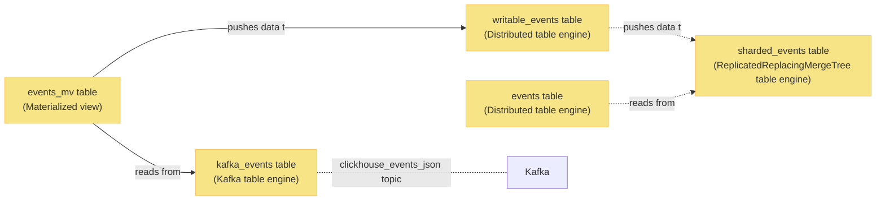

# ClickHouse 在 PostHog 中的应用


ClickHouse 是 PostHog 的核心分析引擎，负责处理和分析大规模事件数据。不同于直接写入数据，PostHog 采用从 Kafka 拉取数据的方式，这种设计显著提高了数据摄入管道的容错能力。

## 架构概览

PostHog 采用分片的 ClickHouse 设置来确保系统的可扩展性。以下是数据流转的整体架构：



## 核心表结构

### 1. Kafka 事件表 (`kafka_events`)

使用 Kafka 表引擎的 `kafka_events` 表作为数据入口：

```sql
CREATE TABLE kafka_events
(
    uuid UUID,
    event String,
    properties String,
    timestamp DateTime64(6, 'UTC'),
    team_id Int64,
    distinct_id String,
    created_at DateTime64(6, 'UTC'),
    elements_chain String
)
ENGINE = Kafka('kafka:9092', 'clickhouse_events_json', 'clickhouse_consumer_group', 'JSONEachRow');
```

这个表的特点：
- 使用 Kafka 表引擎连接 Kafka 集群
- 在查询时消费数据，并更新 Kafka 消费组的偏移量
- 支持 JSON 格式的事件数据解析

### 2. 物化视图 (`events_mv`)

`events_mv` 表作为数据管道，定期从 `kafka_events` 拉取数据并推送到目标表：

```sql
CREATE MATERIALIZED VIEW events_mv
TO writable_events
AS SELECT
    uuid,
    event,
    properties,
    timestamp,
    team_id,
    distinct_id,
    created_at,
    elements_chain
FROM kafka_events;
```

### 3. 可写事件表 (`writable_events`)

使用分布式表引擎的 `writable_events` 表负责数据分发：

```sql
CREATE TABLE writable_events
(
    uuid UUID,
    event String,
    properties String,
    timestamp DateTime64(6, 'UTC'),
    team_id Int64,
    distinct_id String,
    elements_chain String,
    created_at DateTime64(6, 'UTC'),
    _timestamp DateTime,
    _offset UInt64
)
ENGINE = Distributed('posthog', 'posthog', 'sharded_events', sipHash64(distinct_id));
```

关键特性：
- 接收来自 `events_mv` 的数据推送
- 基于 `distinct_id` 计算哈希值进行分片
- 将数据路由到正确的分片节点
- 不包含物化列以优化插入性能

### 4. 分片事件表 (`sharded_events`)

使用 ReplicatedReplacingMergeTree 引擎的 `sharded_events` 表存储实际数据：

```sql
CREATE TABLE sharded_events
(
    uuid UUID,
    event String,
    properties String,
    timestamp DateTime64(6, 'UTC'),
    team_id Int64,
    distinct_id String,
    elements_chain String,
    created_at DateTime64(6, 'UTC'),
    _timestamp DateTime,
    _offset UInt64
)
ENGINE = ReplicatedReplacingMergeTree('/clickhouse/tables/{shard}/posthog.sharded_events', '{replica}', created_at)
PARTITION BY toYYYYMM(timestamp)
ORDER BY (team_id, toDate(timestamp), event, uuid);
```

特点：
- 支持数据分片和复制
- 通过 `events` 表间接查询
- 使用月份作为分区键
- 优化的排序键设计

### 5. 查询事件表 (`events`)

与 `writable_events` 类似，`events` 表也使用分布式表引擎：

```sql
CREATE TABLE events
(
    uuid UUID,
    event String,
    properties String,
    timestamp DateTime64(6, 'UTC'),
    team_id Int64,
    distinct_id String,
    elements_chain String,
    created_at DateTime64(6, 'UTC'),
    _timestamp DateTime,
    _offset UInt64
)
ENGINE = Distributed('posthog', 'posthog', 'sharded_events', sipHash64(distinct_id));
```

功能：
- 处理应用层查询
- 自动确定要查询的分片
- 聚合来自各分片的结果

## 用户数据处理

### 用户表设计

PostgreSQL 是用户信息和 `distinct_id` 映射的主数据源，但为了提升查询性能，这些数据会被复制到 ClickHouse：

```sql
CREATE TABLE person
(
    id UUID,
    created_at DateTime64(6, 'UTC'),
    team_id Int64,
    properties String,
    is_identified Int8,
    is_deleted Int8,
    version UInt64
)
ENGINE = ReplicatedReplacingMergeTree('/clickhouse/tables/{shard}/posthog.person', '{replica}', version)
ORDER BY (team_id, id);

CREATE TABLE person_distinct_id
(
    distinct_id String,
    person_id UUID,
    team_id Int64,
    is_deleted Int8,
    version UInt64
)
ENGINE = ReplicatedReplacingMergeTree('/clickhouse/tables/{shard}/posthog.person_distinct_id', '{replica}', version)
ORDER BY (team_id, distinct_id);
```

特点：
- 使用 ReplacingMergeTree 引擎
- 通过 version 列处理更新
- 在分片设置中完全复制到每个节点
- 避免跨网络 JOIN 操作

## 性能优化

### 1. 查询优化

```sql
-- 使用物化视图优化常见查询
CREATE MATERIALIZED VIEW events_daily
ENGINE = SummingMergeTree
PARTITION BY toYYYYMM(date)
ORDER BY (team_id, date, event)
AS SELECT
    team_id,
    toDate(timestamp) as date,
    event,
    count() as event_count
FROM events
GROUP BY team_id, date, event;
```

### 2. 分片优化

```sql
-- 配置分片权重
SET insert_distributed_sync = 1;
SET optimize_skip_unused_shards = 1;
SET optimize_distributed_group_by_sharding_key = 1;
```

### 3. 数据压缩

```sql
ALTER TABLE events
    MODIFY SETTING min_bytes_for_wide_part = 10485760,
    min_rows_for_wide_part = 512000;
```

## 监控和维护

### 1. 系统监控

```sql
-- 监控分片状态
SELECT
    shard_num,
    shard_weight,
    replica_num,
    is_local
FROM system.clusters
WHERE cluster = 'posthog';

-- 监控表大小
SELECT
    partition,
    name,
    rows,
    bytes_on_disk
FROM system.parts
WHERE table = 'events'
ORDER BY partition;
```

### 2. 性能监控

```sql
-- 查询性能分析
SELECT
    query,
    read_rows,
    read_bytes,
    memory_usage,
    query_duration_ms
FROM system.query_log
WHERE type = 'QueryFinish'
ORDER BY query_duration_ms DESC
LIMIT 10;
```

## 最佳实践

1. **数据写入**：
   - 避免写入重复数据
   - 使用批量插入
   - 合理设置分区策略

2. **查询优化**：
   - 利用物化视图
   - 合理使用分片键
   - 优化 JOIN 操作

3. **运维管理**：
   - 定期监控分片平衡
   - 及时清理过期数据
   - 保持适当的副本数

## 扩展阅读

- [ClickHouse 官方文档](https://clickhouse.com/docs/en/intro)
- [PostHog 数据摄入指南](/handbook/engineering/clickhouse/data-ingestion)
- [ClickHouse 性能优化](https://clickhouse.com/docs/en/operations/performance) 