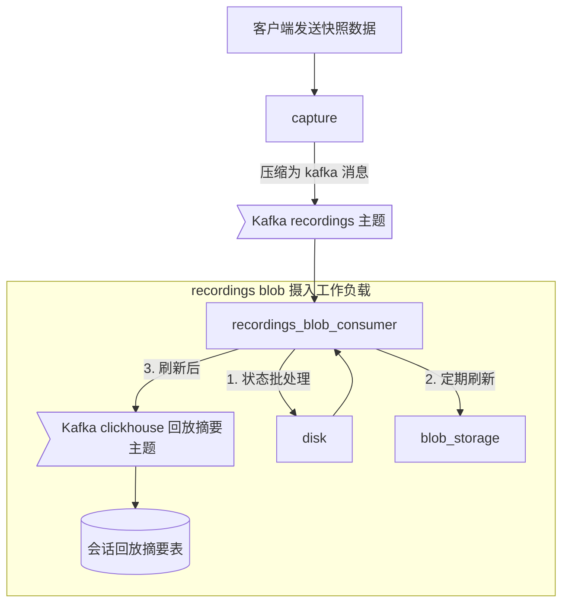

# 会话回放数据存储

## 概述

PostHog 使用 `rrweb` 从浏览器收集"快照数据"。这些数据由捕获 API 收集并发送到摄入服务。由于我们使用 Kafka 进行数据摄入，且存在消息大小限制，而快照数据通常超过这个限制，因此回放功能有其独特的摄入基础设施，具有更大的限制。

我们将录制的快照数据存储在 blob 存储中，并将聚合的会话信息存储在 `session_replay_events` 表中。因此在捕获服务（`posthog-recordings` 部署）中，不再需要对录制进行分块。

摄入工作负载将会话批量写入磁盘，并定期刷新到 blob 存储。这样可以减少写入存储的文件数量，降低系统的运营成本。

## 数据流架构



## 录制元数据

摄入工作负载生成元数据并将其存储在 ClickHouse 的 `session_replay_events` 表中。该表使用 [ClickHouse Aggregating MergeTree 引擎](https://clickhouse.com/docs/en/engines/table-engines/mergetree-family/aggregatingmergetree)，用于支持会话回放 UI。

### 表结构

```sql
CREATE TABLE session_replay_events
(
    session_id UUID,
    team_id Int64,
    distinct_id String,
    min_first_timestamp DateTime64(6, 'UTC'),
    max_last_timestamp DateTime64(6, 'UTC'),
    click_count SimpleAggregateFunction(sum, Int64),
    keypress_count SimpleAggregateFunction(sum, Int64),
    mouse_activity_count SimpleAggregateFunction(sum, Int64),
    active_milliseconds SimpleAggregateFunction(sum, Int64),
    console_log_count SimpleAggregateFunction(sum, Int64),
    console_warn_count SimpleAggregateFunction(sum, Int64),
    console_error_count SimpleAggregateFunction(sum, Int64),
    size_bytes SimpleAggregateFunction(sum, Int64),
    event_count SimpleAggregateFunction(sum, Int64),
    message_count SimpleAggregateFunction(sum, Int64),
    snapshot_source LowCardinality(String)
)
ENGINE = AggregatingMergeTree
PARTITION BY toYYYYMM(min_first_timestamp)
ORDER BY (team_id, toDate(min_first_timestamp), session_id);
```

结合 blob 存储摄入工作负载，这意味着我们在 ClickHouse 中每行存储的数据量比原始基础设施少至少一百倍，并且压缩率提高了约两倍。

## 性能优化

1. **批量处理**：
   - 将会话数据批量写入磁盘
   - 定期刷新到 blob 存储
   - 减少存储操作次数

2. **数据压缩**：
   - 使用高效的压缩算法
   - 优化元数据存储结构
   - 减少存储空间占用

3. **查询优化**：
   - 利用 AggregatingMergeTree 引擎的聚合能力
   - 合理设计分区和排序键
   - 优化会话回放 UI 的查询性能

## 监控和维护

```sql
-- 监控会话回放数据大小
SELECT
    team_id,
    toDate(min_first_timestamp) as date,
    count() as sessions,
    sum(size_bytes) as total_size,
    sum(event_count) as total_events
FROM session_replay_events
GROUP BY team_id, date
ORDER BY date DESC
LIMIT 10;

-- 检查会话活动度
SELECT
    team_id,
    toDate(min_first_timestamp) as date,
    avg(click_count) as avg_clicks,
    avg(keypress_count) as avg_keypresses,
    avg(active_milliseconds)/1000 as avg_active_seconds
FROM session_replay_events
GROUP BY team_id, date
ORDER BY date DESC;
```

## 最佳实践

1. **数据保留策略**：
   - 设置合理的数据保留期限
   - 定期清理过期数据
   - 优化存储成本

2. **监控指标**：
   - 跟踪存储使用情况
   - 监控会话质量
   - 关注性能指标

3. **故障排除**：
   - 检查数据完整性
   - 验证会话连续性
   - 分析异常模式 