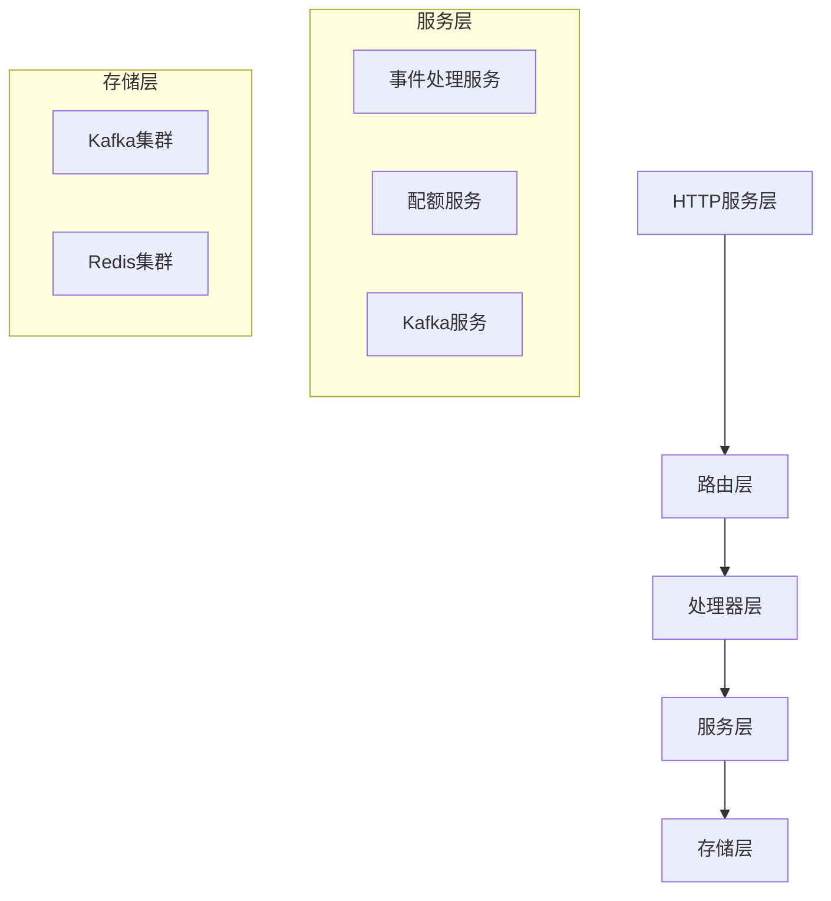
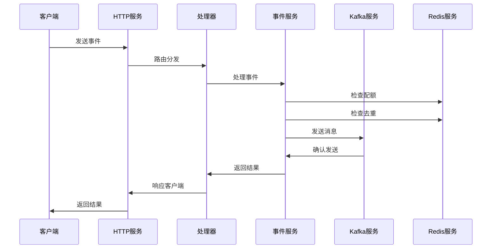

# PostHog Capture 服务架构设计

## 1. 系统概述

### 1.1 设计目标

1. **高性能**
   - 支持高并发事件处理
   - 最小化处理延迟
   - 优化资源使用

2. **高可靠性**
   - 确保事件不丢失
   - 支持故障恢复
   - 提供数据一致性

3. **可扩展性**
   - 支持水平扩展
   - 模块化设计
   - 插件化架构

4. **可观测性**
   - 全面的监控指标
   - 详细的日志记录
   - 分布式追踪支持

### 1.2 技术栈选择

1. **核心框架**
   - Go 1.21+：核心开发语言
   - Gin：HTTP 框架
   - Zap：日志框架

2. **存储系统**
   - Kafka：事件存储和消息队列
   - Redis：缓存和速率限制

3. **监控工具**
   - Prometheus：指标收集
   - Grafana：可视化展示

## 2. 系统架构

### 2.1 核心组件



### 2.2 组件职责

1. **HTTP 服务层**
   - 请求接收和响应
   - 中间件处理
   - 错误处理
   - 跨域支持

2. **路由层**
   - URL 路由匹配
   - 请求参数解析
   - 认证和授权
   - 请求转发

3. **处理器层**
   - 请求验证
   - 数据解析
   - 业务逻辑处理
   - 响应封装

4. **服务层**
   - 事件处理服务
   - 配额控制服务
   - Kafka 生产服务
   - 公共服务

5. **存储层**
   - Kafka 集群
   - Redis 集群

## 3. 详细设计

### 3.1 HTTP 服务层

1. **中间件实现**
   ```go
   type Middleware struct {
       // 中间件配置
       Config *Config
       // 中间件链
       handlers []gin.HandlerFunc
   }
   ```

2. **关键中间件**
   - CORS 中间件
   - 认证中间件
   - 日志中间件
   - 指标中间件
   - 恢复中间件

### 3.2 事件处理服务

1. **接口定义**
   ```go
   type EventProcessor interface {
       ProcessEvent(ctx context.Context, event Event, token string) error
       ProcessRecording(ctx context.Context, event Event, token string) error
   }
   ```

2. **核心功能**
   - 事件验证
   - 去重处理
   - 配额控制
   - 批处理机制

3. **实现细节**
   - 异步处理
   - 重试机制
   - 错误处理
   - 性能优化

### 3.3 配额服务

1. **接口定义**
   ```go
   type QuotaService interface {
       CheckQuota(ctx context.Context, token string, eventType string) (bool, error)
       DecrementQuota(ctx context.Context, token string, eventType string) error
   }
   ```

2. **实现特性**
   - Redis 计数器
   - 过期时间控制
   - 原子操作
   - 配额恢复

### 3.4 Kafka 服务

1. **接口定义**
   ```go
   type KafkaService interface {
       SendEvent(topic string, data []byte, headers map[string]string, key *string) error
       GetEventsTopic() string
       GetRecordingsTopic() string
   }
   ```

2. **实现特性**
   - 异步发送
   - 批量提交
   - 压缩支持
   - 分区策略

## 4. 数据流设计

### 4.1 事件处理流程



### 4.2 数据格式

1. **输入格式**
   ```json
   {
       "event": "事件名称",
       "properties": {
           "distinct_id": "用户标识",
           "token": "项目令牌"
       },
       "timestamp": "时间戳"
   }
   ```

2. **Kafka 消息格式**
   ```json
   {
       "uuid": "事件ID",
       "distinct_id": "用户标识",
       "data": "事件数据",
       "timestamp": "处理时间"
   }
   ```

## 5. 存储设计

### 5.1 Kafka 配置

1. **主题设计**
   - `clickhouse_events`: 普通事件
   - `clickhouse_session_recording_events`: 录制事件
   - `historical_events`: 历史事件
   - `client_warnings`: 客户端警告
   - `exceptions`: 异常事件

2. **分区策略**
   - 基于 token 和 distinct_id 的自定义分区
   - 确保同用户事件顺序
   - 支持水平扩展

### 5.2 Redis 设计

1. **键设计**
   - 配额键：`quota:{token}:{event_type}`
   - 去重键：`event:{distinct_id}:{event}:{timestamp}`
   - 速率键：`rate:{token}:{event_type}`

2. **数据结构**
   - String：配额计数
   - Hash：用户配置
   - Set：去重集合

## 6. 可观测性设计

### 6.1 监控指标

1. **业务指标**
   - 事件接收速率
   - 处理延迟
   - 错误率
   - 配额使用率

2. **系统指标**
   - CPU 使用率
   - 内存使用率
   - Goroutine 数量
   - GC 统计

### 6.2 日志设计

1. **日志级别**
   - DEBUG：调试信息
   - INFO：关键操作
   - WARN：警告信息
   - ERROR：错误信息

2. **日志格式**
   ```json
   {
       "level": "日志级别",
       "timestamp": "时间戳",
       "caller": "调用位置",
       "msg": "日志消息",
       "fields": {
           "event_id": "事件ID",
           "token": "项目令牌"
       }
   }
   ```

## 7. 安全设计

### 7.1 认证机制

1. **Token 验证**
   - 请求头验证
   - 参数验证
   - 多级验证

2. **权限控制**
   - 项目级别权限
   - 接口级别权限
   - 资源级别权限

### 7.2 数据安全

1. **传输安全**
   - TLS 加密
   - 数据压缩
   - 请求签名

2. **存储安全**
   - 数据脱敏
   - 访问控制
   - 审计日志

## 8. 部署架构

### 8.1 容器化部署

1. **Docker 配置**
   ```dockerfile
   FROM golang:1.21-alpine
   WORKDIR /app
   COPY . .
   RUN go build -o capture
   CMD ["./capture"]
   ```

2. **资源配置**
   - CPU 限制
   - 内存限制
   - 存储配置

### 8.2 高可用设计

1. **多实例部署**
   - 负载均衡
   - 自动扩缩容
   - 健康检查

2. **故障转移**
   - 服务发现
   - 自动恢复
   - 数据同步

## 9. 扩展性设计

### 9.1 插件系统

1. **插件接口**
   ```go
   type Plugin interface {
       Init() error
       Process(event Event) error
       Close() error
   }
   ```

2. **支持类型**
   - 数据处理插件
   - 认证插件
   - 存储插件

### 9.2 配置系统

1. **配置结构**
   ```go
   type Config struct {
       Server   ServerConfig
       Kafka    KafkaConfig
       Redis    RedisConfig
       Plugins  PluginConfig
   }
   ```

2. **动态配置**
   - 配置热加载
   - 环境变量支持
   - 配置验证 