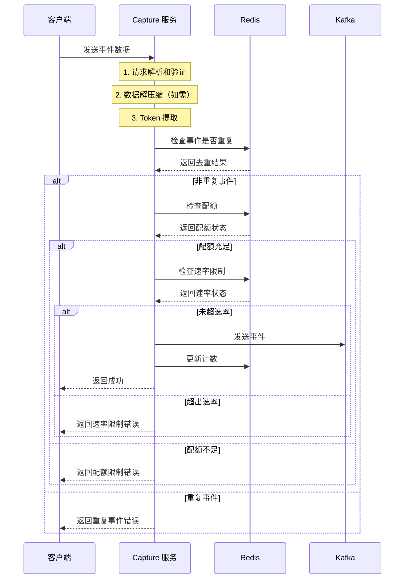
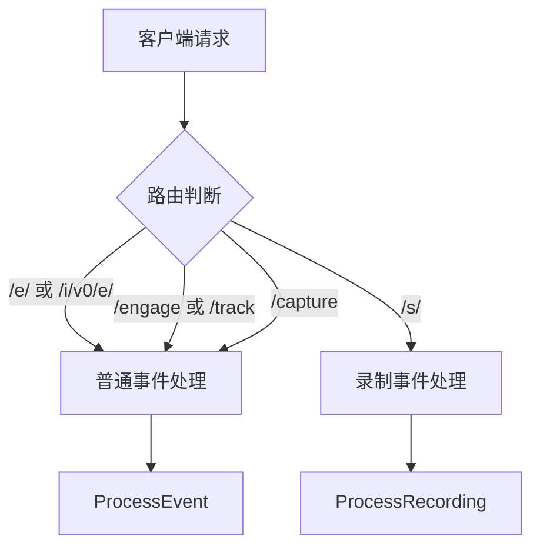
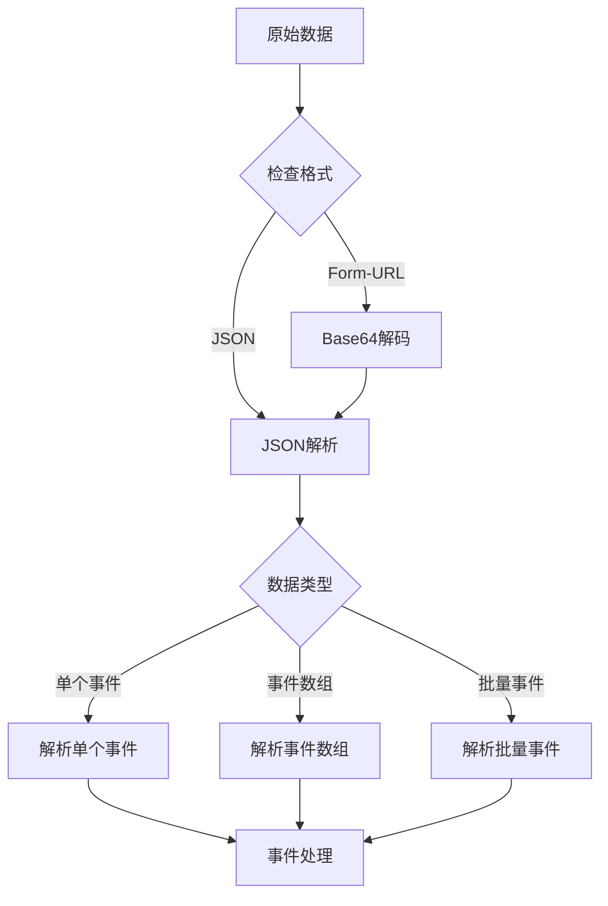

# PostHog Capture 服务详细流程

## 1. 整体流程图



## 2. 详细处理流程

### 2.1 请求接收和路由



### 2.2 数据解析流程



## 3. 事件处理流程

### 3.1 事件验证

1. **基础验证**
   - 事件名称必填
   - 事件名称长度 ≤ 200
   - 事件大小 ≤ 2MB

2. **Token 处理**
   - 从请求头获取
   - 从事件属性获取
   - 从批量事件顶层获取

3. **去重检查**
   - 使用 Redis SETNX
   - 去重键：`event:{distinctID}:{event}:{timestamp}`
   - 过期时间：24小时

### 3.2 配额和速率控制

1. **配额检查**
   ```mermaid
   graph TD
       A[检查配额] --> B{配额是否充足}
       B -->|是| C[继续处理]
       B -->|否| D[返回配额错误]
       C --> E[检查速率]
       E -->|未超限| F[处理事件]
       E -->|超限| G[返回速率错误]
   ```

2. **速率限制**
   - 基于 Redis 实现
   - 按 token 和事件类型限制
   - 支持动态调整

### 3.3 Kafka 消息发送

1. **消息构造**
   ```json
   {
       "uuid": "事件ID",
       "distinct_id": "用户标识",
       "ip": "用户IP",
       "data": "原始事件JSON",
       "now": "当前时间",
       "sent_at": "发送时间",
       "token": "项目令牌"
   }
   ```

2. **消息头部**
   ```json
   {
       "token": "项目令牌",
       "distinct_id": "用户标识"
   }
   ```

3. **主题选择**
   - 普通事件：`clickhouse_events`
   - 录制事件：`clickhouse_session_recording_events`

4. **分区策略**
   - 分区键：`{token}:{distinct_id}`
   - 确保同用户事件顺序

### 3.4 批处理机制

1. **批处理配置**
   - 批处理大小：1（调试模式）
   - 批处理超时：1000ms

2. **重试机制**
   - 最大重试次数：3
   - 重试间隔：递增延迟
   - 失败事件重新入队

## 4. 性能优化

### 4.1 内存优化

1. **数据压缩**
   - 大于1KB的属性自动压缩
   - 支持请求级别压缩

2. **内存池**
   - 事件批处理缓冲池
   - JSON 解析器池

### 4.2 并发处理

1. **异步处理**
   - 事件处理协程池
   - Kafka 异步发送

2. **锁优化**
   - 批处理互斥锁
   - 计数器原子操作

## 5. 监控指标

### 5.1 关键指标

1. **处理指标**
   - 事件接收速率
   - 处理延迟分布
   - 错误率统计

2. **资源指标**
   - Goroutine 数量
   - 内存使用情况
   - CPU 使用率

### 5.2 业务指标

1. **配额指标**
   - 配额使用率
   - 配额限制次数
   - 速率限制次数

2. **Kafka 指标**
   - 消息发送成功率
   - 消息延迟
   - 分区分布

## 6. 错误处理

### 6.1 错误类型

1. **请求错误**
   - 格式错误
   - 大小超限
   - 字段缺失

2. **处理错误**
   - 配额不足
   - 速率超限
   - 重复事件

3. **系统错误**
   - Redis 连接失败
   - Kafka 发送失败
   - 内部处理错误

### 6.2 错误恢复

1. **自动恢复**
   - Kafka 重试机制
   - 批处理重试
   - 连接自动重连

2. **手动干预**
   - 配额调整
   - 速率限制调整
   - 服务重启 