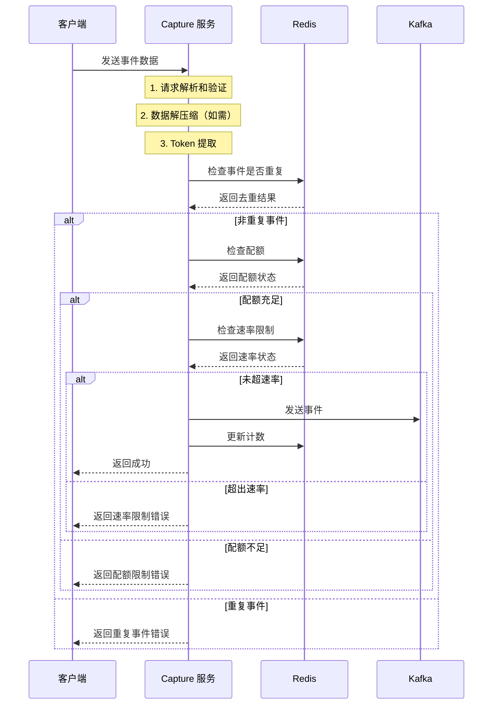
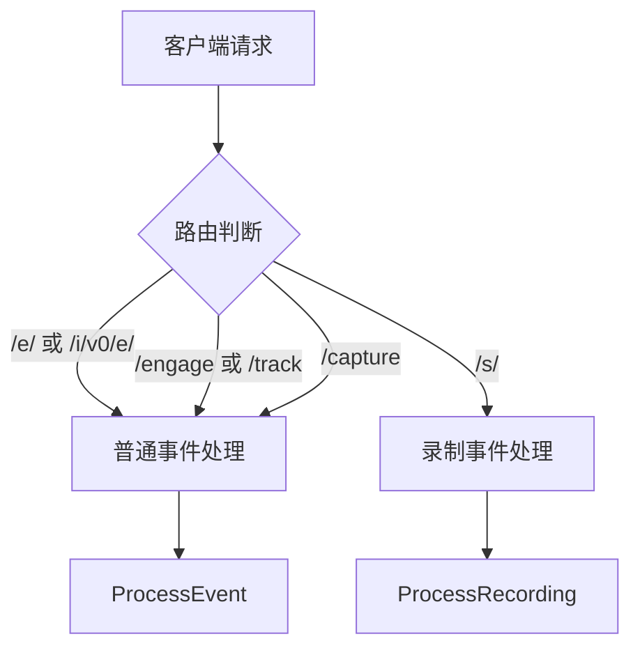
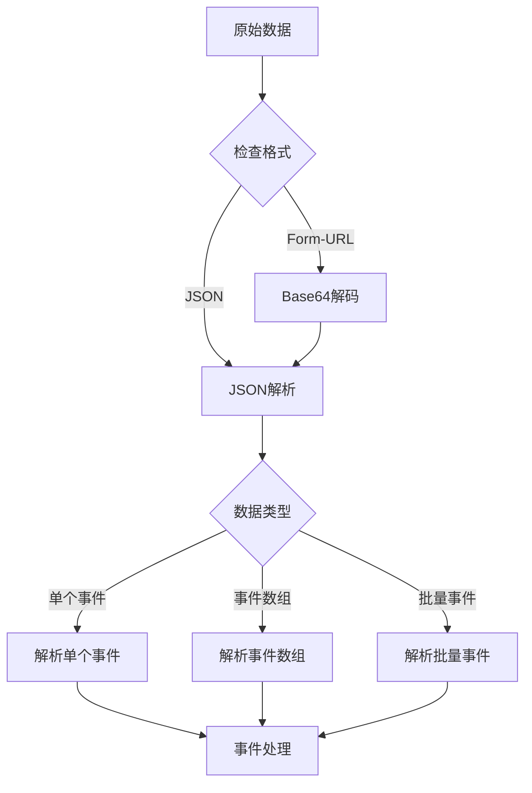
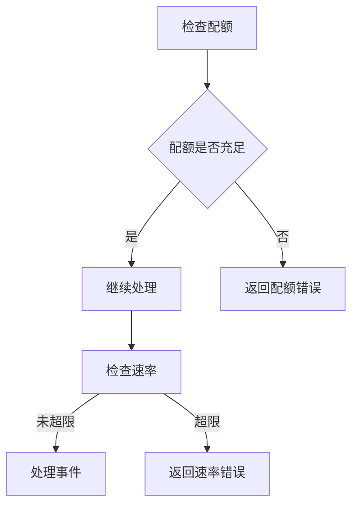

# PostHog Capture 服务详细流程

PostHog 的 Capture 服务是整个数据采集系统的核心组件，它负责接收、处理和转发来自各个客户端的分析事件数据。本文将详细介绍该服务的工作流程、架构设计和关键特性。

## 系统架构概述

Capture 服务采用了现代化的分布式架构设计，主要由事件接收层、数据处理层和消息分发层组成。服务通过 Redis 进行事件去重和流量控制，通过 Kafka 实现可靠的消息传递，确保了整个系统的高可用性和可扩展性。

下面的流程图展示了一个完整的事件处理过程：

## 请求处理流程

### 路由和分发

Capture 服务提供了多个专用的 API 端点来处理不同类型的事件数据。系统会根据请求的 URL 路径将流量分发到相应的处理模块：普通分析事件通过 `/e/`、`/i/v0/e/` 或 `/capture` 端点处理，而会话录制数据则通过 `/s/` 端点处理。这种路由设计确保了不同类型的数据能够得到最适合的处理。

### 数据解析和验证

数据解析是整个处理流程中的关键环节。系统支持多种数据格式，包括 JSON 和 Form-URL 编码的数据。对于 Form-URL 编码的数据，系统会首先进行 Base64 解码，然后再进行 JSON 解析。解析过程不仅要处理单个事件，还要支持事件数组和批量事件的处理。

## 事件处理机制

### 事件验证和去重

事件验证是确保数据质量的第一道防线。系统会对每个事件进行全面的验证，包括检查事件名称（必填且长度不超过 200 字符）和事件大小（不超过 2MB）。Token 的提取也在此阶段进行，系统会依次从请求头、事件属性和批量事件的顶层数据中查找。

去重机制使用 Redis 的 SETNX 操作实现，通过组合用户标识（distinctID）、事件名称和时间戳生成唯一键。系统为每个去重键设置 24 小时的过期时间，在此期间内的重复事件将被过滤。

### 流量控制

流量控制机制包含配额控制和速率限制两个层面。配额控制确保客户端在规定时间内不会超过其允许的事件数量，而速率限制则防止突发的高频请求对系统造成冲击。这两个机制都基于 Redis 实现，支持动态调整限制参数。

### 消息投递

事件数据最终会被转换为标准格式的消息，发送到 Kafka 集群。消息包含事件 ID、用户标识、IP 地址、原始事件数据等信息。系统根据事件类型选择不同的主题：普通事件发送到 `clickhouse_events`，会话录制数据发送到 `clickhouse_session_recording_events`。

为了保证同一用户事件的顺序性，系统使用 `{token}:{distinct_id}` 作为分区键，确保来自同一用户的事件被发送到同一个分区。

## 性能优化

### 数据压缩和内存管理

系统实现了智能的数据压缩机制，对超过 1KB 的属性数据自动进行压缩，同时也支持整个请求级别的压缩。通过使用内存池技术，如事件批处理缓冲池和 JSON 解析器池，系统显著减少了内存分配和垃圾回收的开销。

### 并发处理优化

系统采用协程池来处理事件，实现了高效的并发处理。Kafka 消息的发送采用异步方式，避免了同步等待带来的性能损失。在锁的使用上，系统通过精心设计的批处理互斥锁和原子操作，最大限度地减少了锁竞争。

## 监控和运维

### 系统监控

监控系统覆盖了多个维度的指标：
- 处理性能指标：包括事件接收速率、处理延迟分布和错误率统计
- 资源使用指标：监控 Goroutine 数量、内存使用情况和 CPU 使用率
- 业务指标：跟踪配额使用率、限制触发次数等
- 消息队列指标：监控消息发送成功率、延迟和分区分布情况

### 错误处理和恢复

系统实现了完善的错误处理机制，主要处理三类错误：
- 请求相关：包括格式错误、超限和字段缺失等
- 处理过程：如配额不足、速率超限和重复事件
- 系统级别：处理 Redis 连接、Kafka 发送等基础设施问题

对于大多数错误，系统都实现了自动恢复机制，包括消息重试、连接重建等。对于需要人工干预的情况，系统提供了配额调整、限制参数修改等运维接口。

## 总结

PostHog Capture 服务通过精心设计的架构和处理流程，实现了高效、可靠的事件数据采集。系统的可扩展性、容错能力和性能优化措施确保了它能够在各种负载下稳定运行。持续的监控和完善的错误处理机制则为服务的可维护性提供了保障。 