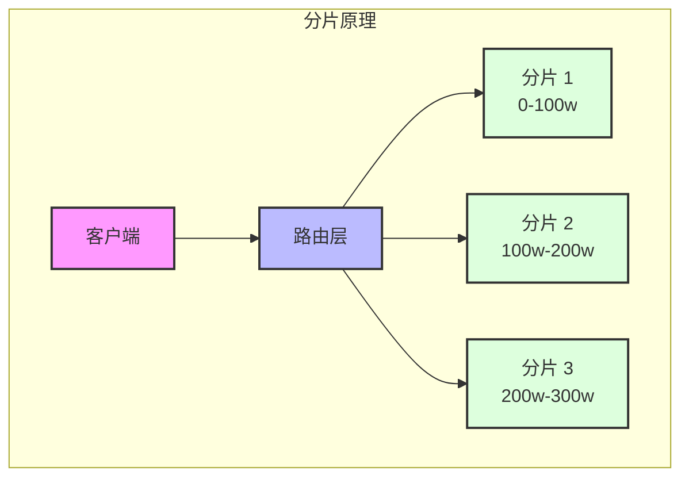
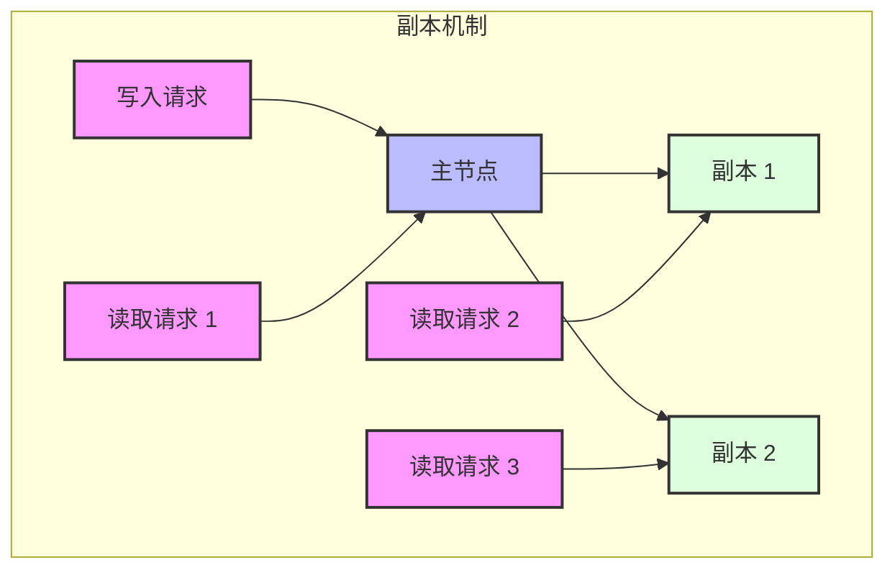
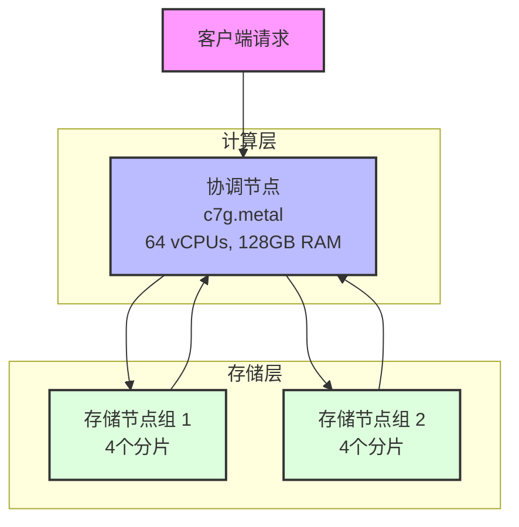

import DataFlowChart from '@site/src/components/DataFlowChart';
import { FaServer, FaDatabase, FaCloud, FaSearch, FaUsers, FaGlobe, FaBalanceScale } from 'react-icons/fa';
import { FaWrench, FaClock } from 'react-icons/fa';

# PostHog Cloud 集群架构

PostHog 目前运营着三个不同的 ClickHouse 集群：

1. Prod-US：美国区主生产集群
2. Prod-EU：欧盟区主生产集群
3. Dev：开发测试集群

export const clusterNodes = [
  {
    id: 'users',
    type: 'custom',
    data: {
      label: '用户',
      description: '全球用户',
      icon: <FaUsers />
    }
  },
  {
    id: 'geo-lb',
    type: 'custom',
    data: {
      label: '地理负载均衡',
      description: '区域路由',
      icon: <FaGlobe />
    }
  },
  {
    id: 'us-lb',
    type: 'custom',
    data: {
      label: '美国区负载均衡',
      description: 'ch-online.posthog.net',
      icon: <FaBalanceScale />
    }
  },
  {
    id: 'eu-lb',
    type: 'custom',
    data: {
      label: '欧盟区负载均衡',
      description: 'ch-online.posthog.eu',
      icon: <FaBalanceScale />
    }
  },
  {
    id: 'us-online',
    type: 'custom',
    data: {
      label: '美国在线集群',
      description: '2分片 2副本',
      icon: <FaCloud />
    }
  },
  {
    id: 'us-offline',
    type: 'custom',
    data: {
      label: '美国离线集群',
      description: '2分片 1副本',
      icon: <FaCloud />
    }
  },
  {
    id: 'eu-coordinator',
    type: 'custom',
    data: {
      label: '欧盟协调节点',
      description: '查询规划和聚合',
      icon: <FaServer />
    }
  },
  {
    id: 'eu-storage',
    type: 'custom',
    data: {
      label: '欧盟存储节点',
      description: '8分片 2副本',
      icon: <FaDatabase />
    }
  }
];

export const clusterEdges = [
  // 用户到地理负载均衡
  { id: 'e1', source: 'users', target: 'geo-lb', label: '请求', animated: true },
  
  // 地理负载均衡到区域负载均衡
  { id: 'e2', source: 'geo-lb', target: 'us-lb', label: '美国区请求', animated: true },
  { id: 'e3', source: 'geo-lb', target: 'eu-lb', label: '欧盟区请求', animated: true },
  
  // 美国区路由
  { id: 'e4', source: 'us-lb', target: 'us-online', label: '实时查询', animated: true },
  { id: 'e5', source: 'us-lb', target: 'us-offline', label: '后台任务', animated: true },
  
  // 欧盟区路由
  { id: 'e6', source: 'eu-lb', target: 'eu-coordinator', label: '查询请求', animated: true },
  { id: 'e7', source: 'eu-coordinator', target: 'eu-storage', label: '数据访问', animated: true }
];

<DataFlowChart
  nodes={clusterNodes}
  edges={clusterEdges}
  direction="TB"
/>

## 分片和副本架构

### 分片（Sharding）

分片是将数据水平分割成多个部分并分布到不同节点的技术。在我们的架构中：

- **目的**：提高系统的处理能力和存储容量
- **原理**：根据分片键（如用户ID、时间等）将数据分散到不同节点
- **优势**：
  - 单表数据量突破单机限制
  - 提升并行处理能力
  - 减少单节点压力

### 副本（Replication）

副本是数据的完整拷贝，用于提供高可用性和故障恢复能力。

- **目的**：保证数据可用性和一致性
- **原理**：通过 ZooKeeper 管理复制过程和故障转移
- **优势**：
  - 提供故障恢复能力
  - 支持读取负载均衡
  - 提高数据可靠性

### 分片和副本配置

| 集群 | 分片数 | 副本数 | 总节点数 | 说明 |
|------|--------|--------|----------|------|
| 美国区在线集群 | 2 | 2 | 4 | 平衡性能和可用性 |
| 美国区离线集群 | 2 | 1 | 2 | 优化成本 |
| 欧盟区存储节点 | 8 | 2 | 16 | 大规模并行处理 |
| 开发测试集群 | 1 | 2 | 2 | 测试环境配置 |

## 共同特征

所有集群都具有以下共同特点：
- 由 ClickHouse 团队管理
- 运行版本为 `23.12.5.81`
- 相似的数据模式
- 统一的数据保留策略
- 统一的备份策略
- 统一的监控和告警机制

### ZooKeeper 配置

我们使用 ZooKeeper 来管理 ClickHouse 的复制表。它负责管理副本之间的数据复制并确保一致性。

| 配置项 | 美国区 | 欧盟区 | 开发环境 |
|--------|--------|--------|----------|
| 节点数量 | 3个节点 | 3个节点 | 3个节点 |
| 实例类型 | m7g.2xlarge | m6g.2xlarge | t4g.small |
| CPU | 8 vCPUs (Graviton2) | 8 vCPUs (Graviton2) | 2 vCPUs (Graviton2) |
| 内存 | 32 GiB RAM | 32 GiB RAM | 2 GiB RAM |
| 网络带宽 | 15 Gbps | 10 Gbps | 5 Gbps |
| 存储 | 200 GiB GP3 EBS | 200 GiB GP3 EBS | 100 GiB GP3 EBS |
| EBS吞吐量 | 1250 MB/s | 593.75 MB/s | 260 MB/s |

export const zookeeperNodes = [
  {
    id: 'zk1',
    type: 'custom',
    data: {
      label: 'ZooKeeper 集群',
      description: '管理复制和一致性',
      icon: <FaWrench />
    }
  },
  {
    id: 'ch1',
    type: 'custom',
    data: {
      label: 'ClickHouse 节点 1',
      description: '主节点',
      icon: <FaDatabase />
    }
  },
  {
    id: 'ch2',
    type: 'custom',
    data: {
      label: 'ClickHouse 节点 2',
      description: '副本节点',
      icon: <FaDatabase />
    }
  }
];

export const zookeeperEdges = [
  { id: 'e1', source: 'zk1', target: 'ch1', animated: true },
  { id: 'e2', source: 'zk1', target: 'ch2', animated: true },
  { id: 'e3', source: 'ch1', target: 'ch2', label: '数据复制', animated: true }
];

<DataFlowChart
  nodes={zookeeperNodes}
  edges={zookeeperEdges}
  direction="TB"
/>

## 美国区生产集群 (Prod-US)

| 配置项 | 在线集群 | 离线集群 |
|--------|----------|-----------|
| 分片数 | 2个分片 | 2个分片 |
| 副本数 | 2个副本 | 1个副本 |
| 实例类型 | i3en.12xlarge | im4gn.16xlarge |
| CPU | 48 vCPUs | 64 vCPUs (Graviton2) |
| 内存 | 384 GiB RAM | 256 GiB RAM |
| 网络带宽 | 50 Gbps | 100 Gbps |
| 本地存储 | 4x7.5TB NVMe SSD (RAID 10) | 4x7.5TB NVMe SSD (RAID 10) |
| EBS存储 | 3x10TB GP3 + 1x16TB GP3 | 3x16TB GP3 + 1x1TB GP3 |

export const usNodes = [
  {
    id: 'app',
    type: 'custom',
    data: {
      label: '应用服务器',
      description: 'PostHog 应用',
      icon: <FaServer />
    }
  },
  {
    id: 'online',
    type: 'custom',
    data: {
      label: '在线集群',
      description: '处理实时查询',
      icon: <FaCloud />
    }
  },
  {
    id: 'offline',
    type: 'custom',
    data: {
      label: '离线集群',
      description: '处理后台任务',
      icon: <FaCloud />
    }
  },
  {
    id: 'tasks',
    type: 'custom',
    data: {
      label: '后台任务',
      description: 'Celery/Temporal',
      icon: <FaClock />
    }
  }
];

export const usEdges = [
  { id: 'e1', source: 'app', target: 'online', label: '实时查询', animated: true },
  { id: 'e2', source: 'tasks', target: 'offline', label: '后台处理', animated: true }
];

<DataFlowChart
  nodes={usNodes}
  edges={usEdges}
  direction="LR"
/>

## 欧盟区生产集群 (Prod-EU)

| 配置项 | 存储节点 | 协调节点 |
|--------|----------|----------|
| 节点数量 | 8个分片，2个副本 | 1个实例 |
| 实例类型 | m6g.8xlarge | c7g.metal |
| CPU | 32 vCPUs (Graviton2) | 64 vCPUs (Graviton3) |
| 内存 | 128 GiB RAM | 128 GiB RAM |
| 网络带宽 | 12 Gbps | 30 Gbps |
| 存储 | 10TB GP3 EBS | 4x2.5TB GP3 EBS |

### 协调节点架构说明

欧盟区采用了计算存储分离的架构：

1. **计算层**
   - 单个强大的协调节点
   - 负责查询规划和结果聚合
   - 高性能 Graviton3 处理器
   - 大内存配置适合复杂查询

2. **存储层**
   - 8个分片，每个分片2个副本
   - 分布式存储减少单节点压力
   - 支持并行数据获取
   - 通过副本保证高可用

3. **数据流程**
   - 客户端发送查询请求到协调节点
   - 协调节点解析并规划查询
   - 并行从存储节点获取数据
   - 在协调节点完成数据聚合
   - 返回最终结果给客户端

## 开发测试集群 (Dev)

| 配置项 | 规格 |
|--------|------|
| 分片数 | 1个分片 |
| 副本数 | 2个副本 |
| 实例类型 | m6id.4xlarge |
| CPU | 16 vCPUs (Intel Xeon 8375C) |
| 内存 | 64 GiB RAM |
| 网络带宽 | 12.5 Gbps |
| 存储 | 950 GiB NVMe临时磁盘 |

export const devNodes = [
  {
    id: 'dev-app',
    type: 'custom',
    data: {
      label: '开发应用',
      description: '测试环境',
      icon: <FaServer />
    }
  },
  {
    id: 'dev-ch1',
    type: 'custom',
    data: {
      label: 'ClickHouse 主节点',
      description: '1个分片',
      icon: <FaDatabase />
    }
  },
  {
    id: 'dev-ch2',
    type: 'custom',
    data: {
      label: 'ClickHouse 副本',
      description: '故障转移',
      icon: <FaDatabase />
    }
  }
];

export const devEdges = [
  { id: 'e1', source: 'dev-app', target: 'dev-ch1', label: '主要查询', animated: true },
  { id: 'e2', source: 'dev-ch1', target: 'dev-ch2', label: '数据同步', animated: true }
];

<DataFlowChart
  nodes={devNodes}
  edges={devEdges}
  direction="TB"
/>

## 当前挑战

目前集群面临的最大挑战是磁盘吞吐量，主要由于频繁的数据变更操作（mutations）导致。每次变更都需要重写大量数据，这会占用正常查询和插入操作的资源。

### 解决方案
1. 迁移到具有本地 NVMe 存储的节点
2. 使用 RAID 10 far 2 配置，提供约 1000 MB/s 写入和 4000 MB/s 读取速度
3. 结合 EBS 存储实现分层存储策略

目前美国区已完全迁移到 NVMe 支持的节点，欧盟区也将逐步完成迁移。 