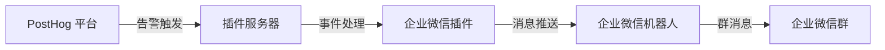
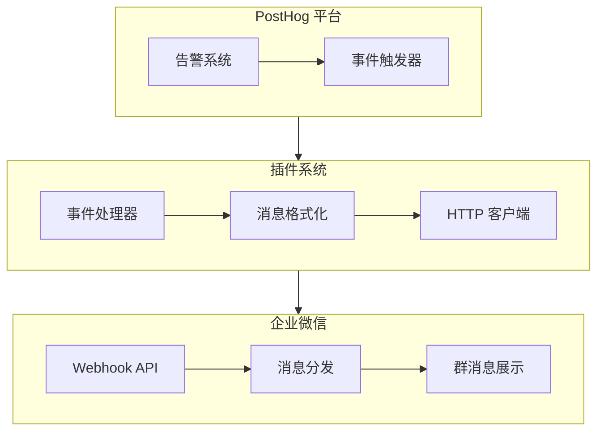

import GitHubCard from '@site/src/components/GithubCard';

## 为什么使用企业微信机器人插件？


<GitHubCard repo="pama-lee/posthog-wecom-plugin" size='medium'/>

企业微信机器人插件可以帮助你：

1. 实时接收 PostHog 平台的告警通知
2. 在企业微信群中快速响应和处理告警
3. 提高团队协作效率和告警处理速度

## 工作原理



### 系统组件



## 功能特性

### 1. 消息通知
- Markdown 格式支持
- 自定义消息模板
- 动态变量替换
- 实时推送

### 2. 配置选项
- Webhook URL 配置
- 消息模板定制
- 告警规则设置
- 群组管理

### 3. 安全性
- HTTPS 加密传输
- Webhook 密钥保护
- 访问权限控制
- 配置加密存储

## 快速开始

1. **安装插件**
   ```bash
   # 在 PostHog 插件市场中搜索并安装
   企业微信机器人通知插件
   ```

2. **配置 Webhook**
   ```json
   {
     "webhookUrl": "https://qyapi.weixin.qq.com/cgi-bin/webhook/send?key=YOUR_KEY",
     "messageTemplate": "## PostHog 告警\n**${alert_name}**\n${description}"
   }
   ```

3. **测试连接**
   ```mermaid
   sequenceDiagram
       participant P as PostHog
       participant W as 企业微信
       P->>W: 发送测试消息
       W-->>P: 返回成功响应
       Note over P,W: 验证配置是否正确
   ```

## 最佳实践

### 告警配置

1. **合理设置告警阈值**
   ```json
   {
     "metric": "events_count",
     "threshold": 1000,
     "timeWindow": "5m"
   }
   ```

2. **分级告警模板**
   ```markdown
   ## [${level}] 系统告警
   - 告警名称: ${alert_name}
   - 触发时间: ${trigger_time}
   - 详细信息: ${description}
   ```

### 消息模板

1. **基础模板**
   ```markdown
   ## PostHog 告警通知
   **告警名称**: ${alert_name}
   **触发时间**: ${trigger_time}
   **详细信息**: ${description}
   ```

2. **高级模板**
   ```markdown
   ## 🚨 PostHog 告警通知
   ### 📊 告警详情
   - **名称**: ${alert_name}
   - **级别**: ${level}
   - **时间**: ${trigger_time}
   
   ### 📝 详细信息
   ${description}
   
   ### 🔗 相关链接
   [查看仪表盘](${dashboard_url})
   ```

## 故障排除

### 常见问题

1. **消息发送失败**
   ```mermaid
   graph TD
       A[发送失败] --> B{检查网络}
       B -->|正常| C{验证 URL}
       B -->|异常| D[修复网络]
       C -->|正确| E{查看日志}
       C -->|错误| F[更新 URL]
   ```

2. **配置问题**
   - 检查 Webhook URL 格式
   - 验证消息模板语法
   - 确认权限设置

## API 参考

### 事件结构
```typescript
interface PluginEvent {
    event: string              // 事件类型
    properties: {
        alert_name: string     // 告警名称
        description: string    // 告警描述
        insight_name?: string  // 洞察名称
        dashboard_name?: string // 仪表盘名称
    }
}
```

### 配置选项
```typescript
interface PluginConfig {
    webhookUrl: string        // Webhook URL
    messageTemplate: string   // 消息模板
}
```

## 性能优化

### 监控指标
1. 消息延迟
2. 发送成功率
3. 错误率统计

### 优化建议
1. 合理设置重试策略
2. 优化消息大小
3. 调整并发限制

## 更新日志

### v1.0.0
- 初始版本发布
- 基础告警功能
- Markdown 支持

## 相关资源

- [PostHog 文档](https://posthog.com/docs)
- [企业微信 API 文档](https://work.weixin.qq.com/api/doc)
- [插件 GitHub 仓库](https://github.com/pama-lee/posthog-wecom-plugin)

## 贡献指南

欢迎提交 Pull Request 和 Issue！

