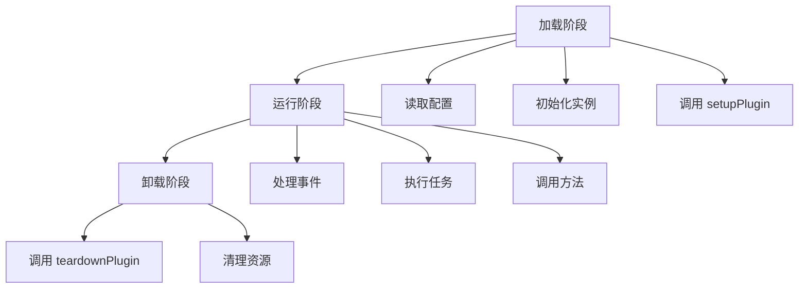
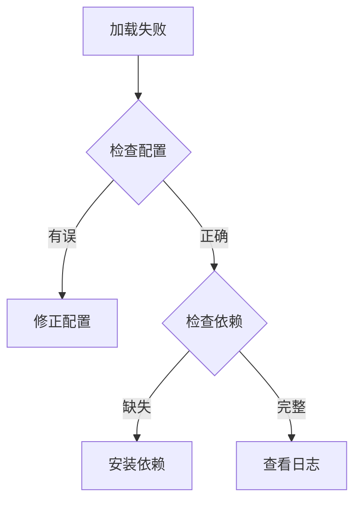

# 🔌 PostHog 插件系统

## 概述

PostHog 插件系统是一个强大而灵活的扩展机制，让开发者能够通过插件来扩展和自定义 PostHog 的功能。插件可以:

- 处理事件流
- 执行定时任务
- 集成外部系统
- 自定义数据处理
- 扩展用户界面

## 插件类型

PostHog 支持以下几种类型的插件:

| 类型 | 描述 | 使用场景 |
|------|------|----------|
| `local` | 本地开发的插件 | 开发和测试阶段 |
| `repository` | 从代码仓库安装的插件 | 生产环境部署 |
| `custom` | 自定义插件 | 特定需求定制 |
| `source` | 源代码形式的插件 | 二次开发 |
| `inline` | 内联插件 | 简单功能扩展 |

## 插件配置

### plugin.json

每个插件都需要一个 `plugin.json` 配置文件:

```json
{
  "name": "插件名称",
  "description": "插件描述",
  "url": "插件主页",
  "main": "入口文件",
  "lib": "库文件",
  "config": {
    // 插件配置项定义
  }
}
```

### 配置项类型

| 类型 | 说明 | 示例 |
|------|------|------|
| `string` | 字符串 | 用户名、URL |
| `boolean` | 布尔值 | 开关标志 |
| `json` | JSON对象 | 复杂配置 |
| `number` | 数字 | 阈值、数量 |
| `date` | 日期 | 开始时间 |
| `daterange` | 日期范围 | 统计周期 |

## 插件功能

### 事件处理

插件可以通过实现以下方法来处理事件:

```typescript
interface PluginMethods {
  // 插件初始化
  setupPlugin?: () => Promise<void>
  
  // 插件清理
  teardownPlugin?: () => Promise<void>
  
  // 获取插件设置
  getSettings?: () => PluginSettings
  
  // 处理事件
  onEvent?: (event: ProcessedPluginEvent) => Promise<void>
  
  // 组装 Webhook
  composeWebhook?: (event: PostHogEvent) => Webhook | null
  
  // 处理事件
  processEvent?: (event: PluginEvent) => Promise<PluginEvent>
}
```

### 定时任务

```typescript
interface PluginTask {
  name: string
  type: 'job' | 'schedule'
  exec: (payload?: Record<string, any>) => Promise<any>
}
```

### 插件能力

```typescript
interface PluginCapabilities {
  jobs?: string[]  // 支持的任务
  scheduled_tasks?: string[] // 支持的定时任务
  methods?: string[] // 支持的方法
}
```

## 插件生命周期



## 插件开发指南

### 目录结构

```
my-plugin/
  ├── plugin.json     # 插件配置
  ├── index.ts        # 主入口文件
  ├── frontend.tsx    # 前端组件(可选)
  └── site.ts         # 站点相关代码(可选) 
```

### 开发流程

1. 创建插件配置文件
2. 实现必要的插件方法
3. 编写测试用例
4. 构建和打包
5. 发布插件

### 最佳实践

1. 合理使用插件配置项
2. 处理异常情况
3. 添加日志记录
4. 遵循性能优化建议
5. 做好版本控制

## 插件安全

### 权限级别

```typescript
enum OrganizationPluginsAccessLevel {
  NONE = 0,    // 无权限
  CONFIG = 3,  // 配置权限
  INSTALL = 6, // 安装权限
  ROOT = 9,    // 根权限
}
```

### 安全建议

| 领域 | 建议 |
|------|------|
| 权限控制 | 遵循最小权限原则 |
| 数据验证 | 验证所有输入数据 |
| 密钥管理 | 安全存储敏感信息 |
| 通信安全 | 使用 HTTPS 协议 |
| 依赖管理 | 定期更新依赖项 |

## 监控和调试

### 日志级别

```typescript
enum PluginLogLevel {
  Full = 0,     // 所有日志
  Log = 1,      // 除 debug 外的所有日志
  Info = 2,     // 除 log 和 debug 外的所有日志
  Warn = 3,     // 仅警告和错误
  Critical = 4,  // 仅错误和系统日志
}
```

### 性能指标

| 指标类型 | 说明 |
|----------|------|
| 处理时间 | 事件处理耗时 |
| 错误率 | 处理失败比例 |
| 资源使用 | CPU/内存占用 |
| API调用 | 接口调用统计 |

## 常见问题

### 1. 插件加载失败


### 2. 性能问题
- 优化事件处理逻辑
- 减少外部 API 调用
- 使用缓存机制

### 3. 版本兼容
- 遵循语义化版本
- 保持向后兼容
- 及时更新文档

## API 参考

### 事件对象

```typescript
interface PluginEvent {
  uuid: string
  event: string
  properties: Properties
  timestamp: string
  team_id: number
  distinct_id: string
}
```

### Webhook 对象

```typescript
interface Webhook {
  url: string
  headers?: Record<string, string>
  payload: any
}
```

### 配置模式

```typescript
interface PluginConfigSchema {
  type: string
  default?: any
  required?: boolean
  title?: string
  description?: string
}
```

## 示例插件

### 基础插件模板

```typescript
export function setupPlugin({ config }) {
  // 插件初始化代码
}

export function teardownPlugin() {
  // 清理代码
}

export async function onEvent(event) {
  // 事件处理逻辑
}
```

### 定时任务示例

```typescript
export const jobs = {
  dailyReport: {
    name: 'daily-report',
    type: 'schedule',
    exec: async () => {
      // 定时任务逻辑
    }
  }
}
```

## 更多资源

- [插件开发教程](https://posthog.com/docs/plugins/build)
- [API 文档](https://posthog.com/docs/api)
- [示例插件](https://github.com/PostHog/plugin-examples)
- [插件最佳实践](https://posthog.com/docs/plugins/best-practices)
- [故障排除指南](https://posthog.com/docs/plugins/troubleshooting)

## 技术实现

### 插件加载流程

1. 插件文件读取
```typescript
function readFileIfExists(baseDir: string, plugin: Plugin, file: string): string | null {
    const fullPath = path.resolve(baseDir, plugin.url!.substring(5), file)
    if (fs.existsSync(fullPath)) {
        return fs.readFileSync(fullPath).toString()
    }
    return null
}
```

2. 插件初始化
```typescript
async function loadPlugin(hub: Hub, pluginConfig: PluginConfig): Promise<boolean> {
    // 1. 检查插件类型
    if (plugin.plugin_type === 'inline') {
        await pluginConfig.instance?.initialize!('', pluginDigest(plugin))
        return true
    }

    // 2. 加载配置
    const configJson = isLocalPlugin
        ? readFileIfExists(hub.BASE_DIR, plugin, 'plugin.json')
        : plugin.source__plugin_json

    // 3. 加载源代码
    const pluginSource = isLocalPlugin
        ? config['main']
            ? readFileIfExists(hub.BASE_DIR, plugin, config['main'])
            : readFileIfExists(hub.BASE_DIR, plugin, 'index.js')
        : plugin.source__index_ts
}
```

### 虚拟机实现

PostHog 使用 VM2 来运行插件代码,确保安全性和隔离性:

```typescript
export class LazyPluginVM implements PluginInstance {
    // 插件VM实例
    private vm: VM
    
    // 插件状态
    private ready: boolean
    private inErroredState: boolean
    
    // 重试机制
    private totalInitAttemptsCounter: number
    private initRetryTimeout: NodeJS.Timeout | null

    // 初始化VM
    private initVm() {
        this.resolveInternalVm = new Promise((resolve) => {
            // VM初始化逻辑
        })
    }

    // 设置插件
    public async setupPluginIfNeeded(): Promise<boolean> {
        if (!this.ready) {
            const vm = (await this.resolveInternalVm)?.vm
            try {
                await this._setupPlugin(vm)
            } catch (error) {
                return false
            }
        }
        return true
    }
}
```

### 插件能力检测

```typescript
async function updatePluginCapabilitiesIfNeeded(vm: PluginConfigVMResponse): Promise<void> {
    const capabilities = getVMPluginCapabilities(vm)
    if (!equal(capabilities, this.pluginConfig.plugin?.capabilities)) {
        await setPluginCapabilities(this.hub, this.pluginConfig.plugin!.id, capabilities)
        this.pluginConfig.plugin!.capabilities = capabilities
    }
}
```

### 错误处理

1. 初始化错误
```typescript
class SetupPluginError extends Error {
    constructor(message: string) {
        super(message)
        this.name = 'SetupPluginError'
    }
}
```

2. 错误重试机制
```typescript
const VM_INIT_MAX_RETRIES = 5
const INITIALIZATION_RETRY_MULTIPLIER = 2
const INITIALIZATION_RETRY_BASE_MS = 5000
```

### 性能监控

使用 Prometheus 指标收集插件性能数据:

```typescript
const pluginSetupMsSummary = new Summary({
    name: 'plugin_setup_ms',
    help: 'Time to setup plugins',
    labelNames: ['plugin_id', 'status'],
})

const pluginDisabledBySystemCounter = new Counter({
    name: 'plugin_disabled_by_system',
    help: 'Count of plugins disabled by the system',
    labelNames: ['plugin_id'],
})
```

### 日志系统

```typescript
async function createLogEntry(
    message: string, 
    logType = PluginLogEntryType.Info
): Promise<void> {
    await this.hub.db.queuePluginLogEntry({
        pluginConfig: this.pluginConfig,
        message: message,
        source: PluginLogEntrySource.System,
        type: logType,
        instanceId: this.hub.instanceId,
    })
}
```

### 安全限制

1. 自我复制保护
```typescript
if (this.pluginConfig.plugin?.name == 'Replicator') {
    // 防止插件自我复制导致无限循环
    const isAllowed = team?.uuid == ALLOWED_UUID && host == ALLOWED_HOST
    if (!isAllowed && team?.api_token.trim() == apiKey.trim()) {
        throw Error('Self replication is not allowed')
    }
}
```

2. 资源限制
```typescript
const RESOURCE_LIMITS = {
    maxMemory: 100 * 1024 * 1024, // 100MB
    timeout: 1000 * 60, // 1分钟
}
```

### 插件通信

1. 事件总线
```typescript
interface EventBus {
    emit(event: string, payload: any): void
    on(event: string, handler: (payload: any) => void): void
}
```

2. 插件间通信
```typescript
async function sendToPlugin(targetPlugin: string, message: any) {
    await this.hub.pluginBus.emit(`plugin:${targetPlugin}`, message)
}
```

## 事件处理详解

### 事件类型

PostHog 插件系统支持以下几种主要事件类型：

1. 原始事件 (PluginEvent)
```typescript
interface PluginEvent {
    uuid: string           // 事件唯一标识
    event: string         // 事件名称
    properties: Properties // 事件属性
    timestamp: string     // 事件时间戳
    team_id: number      // 团队ID
    distinct_id: string   // 用户唯一标识
}
```

2. 处理后事件 (ProcessedPluginEvent)
```typescript
interface ProcessedPluginEvent extends PluginEvent {
    // 包含了更多处理后的信息
    person?: {
        uuid: string
        properties: Properties
        created_at: string
    }
    group_properties?: Record<string, Properties>
}
```

3. PostHog 事件 (PostHogEvent)
```typescript
interface PostHogEvent {
    // 用于新版本插件的事件格式
    distinctId: string
    properties: Properties
    event: string
    timestamp: string
    teamId: number
}
```

### 事件处理流程

1. 事件接收阶段
```typescript
// 1. 事件进入系统
interface PreIngestionEvent {
    eventUuid: string
    event: string
    teamId: number
    projectId: number
    distinctId: string
    properties: Properties
    timestamp: string
}
```

2. 事件处理阶段
```typescript
// 2. 插件处理事件
async function processEvent(event: PluginEvent): Promise<PluginEvent> {
    // 插件可以:
    // - 修改事件属性
    // - 添加新属性
    // - 过滤事件
    return event
}

// 3. 事件后处理
async function onEvent(event: ProcessedPluginEvent): Promise<void> {
    // 插件可以:
    // - 发送事件到外部系统
    // - 触发其他操作
    // - 记录数据
}
```

3. Webhook 处理
```typescript
// 4. Webhook 组装
function composeWebhook(event: PostHogEvent): Webhook | null {
    return {
        url: string,
        headers?: Record<string, string>,
        payload: any
    }
}
```

### 特殊事件

1. 系统事件
```typescript
const SYSTEM_EVENTS = {
    $set: '设置用户属性',
    $identify: '识别用户',
    $create_alias: '创建别名',
    $merge_dangerously: '合并用户',
    $groupidentify: '识别组'
}
```

2. 监控事件
```typescript
interface PluginLogEntry {
    id: string
    team_id: number
    plugin_id: number
    timestamp: string
    source: PluginLogEntrySource
    type: PluginLogEntryType
    message: string
    instance_id: string
}
```

### 事件属性处理

1. 属性类型
```typescript
enum PropertyType {
    DateTime = 'DateTime',
    String = 'String',
    Numeric = 'Numeric',
    Boolean = 'Boolean',
    Duration = 'Duration',
    Selector = 'Selector',
    Cohort = 'Cohort'
}
```

2. 属性定义
```typescript
interface PropertyDefinition {
    name: string
    type: PropertyType
    required?: boolean
    default?: any
    description?: string
}
```

### 事件处理能力

插件服务器根据不同模式提供不同的事件处理能力：

```typescript
enum PluginServerMode {
    ingestion = 'ingestion',           // 事件接收
    async_onevent = 'async-onevent',   // 异步事件处理
    async_webhooks = 'async-webhooks', // 异步Webhook处理
    jobs = 'jobs',                     // 任务处理
    scheduler = 'scheduler'            // 调度器
}
```

### 事件处理指标

系统会收集以下事件处理指标：

1. 性能指标
```typescript
const pluginSetupMsSummary = new Summary({
    name: 'plugin_setup_ms',
    help: '插件设置时间',
    labelNames: ['plugin_id', 'status']
})
```

2. 错误指标
```typescript
const pluginDisabledBySystemCounter = new Counter({
    name: 'plugin_disabled_by_system',
    help: '系统禁用的插件数量',
    labelNames: ['plugin_id']
})
```

### 事件处理最佳实践

1. 性能优化
   - 使用批量处理
   - 实现缓存机制
   - 避免同步阻塞

2. 错误处理
   - 实现重试机制
   - 记录详细日志
   - 设置超时限制

3. 数据验证
   - 验证事件格式
   - 检查必要字段
   - 清理无效数据

4. 安全考虑
   - 验证数据来源
   - 限制资源使用
   - 加密敏感信息

## 插件服务器实现

### 服务器架构

1. 主线程
```typescript
// 主线程负责:
1. pubSub - 基于Redis的发布订阅机制,用于在主PostHog应用发布消息时重新加载插件
2. hub - 管理数据库和队列连接(ClickHouse, Kafka, Postgres, Redis)
3. piscina - 线程池管理器
```

2. 工作线程
```typescript
// 每个工作线程运行:
1. TASKS_PER_WORKER 个任务
2. 独立的Hub实例
3. 独立的VM环境
```

### 服务器模式

```typescript
enum PluginServerMode {
    all_v2 = 'all-v2',               // 完整功能
    ingestion = 'ingestion',         // 数据接收
    async_onevent = 'async-onevent', // 异步事件处理
    async_webhooks = 'async-webhooks',// 异步Webhook
    jobs = 'jobs',                   // 任务处理
    scheduler = 'scheduler',         // 调度器
    analytics_ingestion = 'analytics-ingestion' // 分析数据接收
}
```

### 插件加载流程

1. 初始化阶段
```typescript
async function startPluginsServer(
    config: Partial<PluginsServerConfig>,
    capabilities?: PluginServerCapabilities
): Promise<ServerInstance> {
    // 1. 创建服务器实例
    // 2. 初始化数据库连接
    // 3. 启动工作线程
    // 4. 加载插件
}
```

2. 插件加载
```typescript
async function loadPlugin(hub: Hub, pluginConfig: PluginConfig): Promise<boolean> {
    // 1. 检查插件类型
    if (plugin.plugin_type === 'inline') {
        return initializeInlinePlugin()
    }

    // 2. 加载配置
    const configJson = loadPluginConfig()
    
    // 3. 加载源代码
    const pluginSource = loadPluginSource()
    
    // 4. 初始化VM
    const vm = createPluginConfigVM()
}
```

3. VM初始化
```typescript
class LazyPluginVM implements PluginInstance {
    private initVm() {
        this.resolveInternalVm = new Promise((resolve) => {
            // 1. 创建VM实例
            const vm = createPluginConfigVM()
            
            // 2. 检测插件能力
            await this.updatePluginCapabilitiesIfNeeded(vm)
            
            // 3. 设置插件
            if (shouldSetupNow) {
                await this._setupPlugin(vm.vm)
            }
        })
    }
}
```

### 插件执行环境

1. VM配置
```typescript
function createPluginConfigVM(
    hub: Hub,
    pluginConfig: PluginConfig,
    indexJs: string
): PluginConfigVMResponse {
    // 1. 创建隔离的VM环境
    const vm = new VM({
        sandbox: {
            // 注入全局对象
            console,
            exports,
            require: createRequire()
        }
    })

    // 2. 注入插件API
    const methods = {
        setupPlugin: bindMeta('setupPlugin'),
        teardownPlugin: bindMeta('teardownPlugin'),
        onEvent: bindMeta('onEvent'),
        processEvent: bindMeta('processEvent'),
        composeWebhook: bindMeta('composeWebhook')
    }

    // 3. 注入任务API
    const tasks = {
        schedule: {},
        job: {}
    }
}
```

2. 安全限制
```typescript
const VM_SECURITY_SETTINGS = {
    timeout: 1000 * 60,          // 60秒超时
    allowAsync: true,            // 允许异步
    sandbox: true,               // 沙箱环境
    eval: false,                 // 禁止eval
    wasm: false,                // 禁止WebAssembly
    fixAsync: true              // 修复异步问题
}
```

### 插件通信机制

1. Redis PubSub
```typescript
class PubSub {
    // 发布消息
    async publish(channel: string, message: any): Promise<void>
    
    // 订阅消息
    async subscribe(channel: string, handler: (message: any) => void): Promise<void>
}
```

2. 事件总线
```typescript
class EventBus {
    // 发送事件
    async emit(event: string, payload: any): Promise<void>
    
    // 监听事件
    async on(event: string, handler: (payload: any) => void): Promise<void>
}
```

### 错误处理机制

1. 重试机制
```typescript
const RETRY_SCHEDULE = {
    maxRetries: 5,
    baseDelay: 5000,
    maxDelay: 60000,
    factor: 2
}
```

2. 错误监控
```typescript
interface PluginError {
    message: string
    time: string
    name?: string
    stack?: string
    event?: PluginEvent | null
}
```

### 性能优化

1. 批处理
```typescript
interface BatchProcessor {
    // 批量处理事件
    processBatch(events: PluginEvent[]): Promise<void>
    
    // 刷新批处理
    flush(): Promise<void>
}
```

2. 缓存机制
```typescript
interface CacheManager {
    // 获取缓存
    get(key: string): Promise<any>
    
    // 设置缓存
    set(key: string, value: any, ttl?: number): Promise<void>
}
``` 